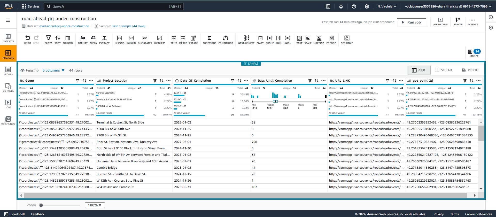
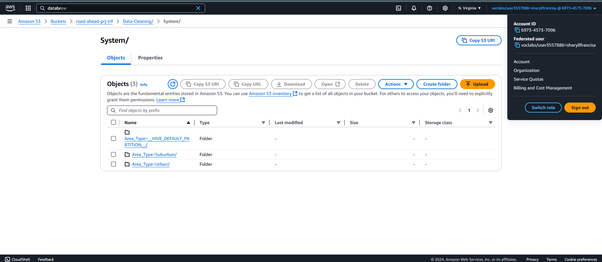

# Data-Analyst-Sharyll
# data-analyst-Sharyll
# Project Title: Data Analysis and ETL Pipeline Design for "The Road Ahead" Projects

## Objective
To analyze and automate data processing workflows for "The Road Ahead" projects, focusing on descriptive and exploratory analysis to uncover trends and actionable insights related to project completion times and location-based performance.

---

## Descriptive Analysis

### Question
What is the relationship between project location and the days left for completion?

### Methodology

#### Data Ingestion
- Uploaded the raw dataset (`road-ahead-projects-under-construction.csv`) to the S3 bucket under the "raw" folder.
- 

#### Data Profiling
- Created a DataBrew project titled "road-ahead-project-analysis."
- Ran profiling jobs to identify missing values in `Project_Location` and empty `Street` fields.
- 

#### Data Cleaning
- Excluded rows with vague locations like "Various Locations."
- Merged `Project` and `Location` columns into a new column `Projects_Location`.
- Standardized `Comp_Date` formats and renamed it to `Date_to_Completion`.
- Created a new calculated column `Days_Until_Completion` to determine remaining days.
- 
- 

#### ETL Pipeline Design
- Built a visual ETL workflow in AWS Glue Studio:
  - **Filter Transformation**: Removed invalid locations.
  - **Aggregate Transformation**: Calculated metrics (average and count) for `Days_Until_Completion` by location.
  - Stored output in "System" and "User" folders in CSV and Parquet formats.
  - 

### Tools and Technologies
- AWS S3, Glue Studio, Glue DataBrew

### Deliverables
- Cleaned dataset saved in AWS S3.
- Automated ETL pipeline in AWS Glue Studio.
- Insights report on trends and project completion times.

### Outcome
- **Trends in Project Locations**:
  - Certain locations experienced longer average completion times, indicating challenges or inefficiencies.
  - Locations with shorter completion times indicated better-managed or smaller projects.
  
- **Highlights**:
  - Projects with overdue completion dates (negative `Days_Until_Completion`) were flagged for further investigation.

---

## Exploratory Analysis

### Project Title
Exploring the Impact of Area Type (Urban/Suburban) on Project Timelines

### Objective
To examine how urban and suburban project classifications influence project completion times and identify delays or efficiencies.

### Dataset

- **Filename**: `area-type-dataset.csv`
- **Source**: AWS S3 (raw folder)
- **Key Features**:
  - `Area_Type`: Urban or Suburban classification.
  - `Days_Until_Completion`: Days left until project completion.

### Methodology

#### Data Ingestion
- Uploaded the raw dataset to S3 under the "area-type-dataset" folder.
- 

#### Data Profiling
- Created a DataBrew project titled "road-ahead-area-type-analysis."
- Analyzed correlations between `Area_Type` and `Days_Until_Completion`.
- 

#### Data Cleaning
- Standardized `Comp_Date` formats and calculated `Days_Until_Completion`.
- Removed invalid entries like "Various Locations."
- 

#### ETL Pipeline Design
- Built a visual ETL pipeline in Glue Studio:
  - **Filter Transformation**: Removed invalid or vague project locations.
  - **Aggregate Transformation**: Analyzed `Days_Until_Completion` for urban and suburban areas.
  - Merged datasets to compare project timelines across classifications.
  - Stored outputs in S3 folders (Urban and Suburban projects) in CSV and Parquet formats.
  - 

### Tools and Technologies
- AWS S3, Glue Studio, Glue DataBrew

### Deliverables
- Cleaned and categorized datasets (Urban and Suburban) in AWS S3.
- Automated ETL pipeline in AWS Glue Studio.
- Analytical report on area-type impact on timelines.

### Outcome
- **Trends in Area Types**:
  - Urban projects exhibited a wider range of completion times, reflecting varying complexities.
  - Suburban projects showed consistent timelines, likely due to smaller scale or better management.

- **Highlights**:
  - Delays in urban projects identified a need for improved resource allocation.
  - Suburban projects demonstrated efficiency, offering benchmarks for urban planning.

---

## Additional Notes
- The projects above focus on creating efficient ETL pipelines, analyzing the impact of location and area type on project completion times, and using AWS Glue, Athena, and DataBrew for seamless data processing and insights generation.

- # Data Infrastructure Implementation

## Project Title: Data Enrichment, Protection, Governance, and Observability for "The Road Ahead" Projects

### Objective:
To implement AWS services for data enrichment, protection, governance, and observability, ensuring secure, organized, and efficient management of datasets for "The Road Ahead" projects.

### Dataset:
**Source**: AWS S3  
**Folders**:  
- **RAW**: Original unprocessed data  
- **TRF**: Transformed data  
- **CUR**: Curated data  

### Methodology:

#### Step 1: Data Enrichment
- Created **AWS Glue crawlers** to catalog datasets from the **RAW**, **TRF**, and **CUR** folders.
- Used **AWS Athena** to validate and run queries on the cataloged tables to ensure the data is complete and usable.
- 
- 

#### Step 2: Data Protection
- Applied **AWS KMS** (Key Management Service) encryption to ensure that all datasets are protected.
- Set up **replication** of datasets from the **RAW**, **TRF**, and **CUR** folders into backup S3 buckets to ensure data redundancy and support disaster recovery strategies.
- 

#### Step 3: Data Governance
- Applied **governance best practices** using **AWS Glue**, implementing data quality rules and detecting sensitive data (PII) by applying custom patterns.
- 

#### Step 4: Data Observability
- Configured a **CloudWatch** dashboard to monitor key metrics:
  - Estimated charges
  - Object count in S3 buckets
  - Bucket storage size (`BucketSizeBytes`)
- Visualized data activity via **pie charts** to track usage and costs.
- 

### Tools and Technologies:

- **AWS Services**: S3, Glue, Athena, KMS, CloudWatch  
- **Data Enrichment**: AWS Glue Crawlers, Athena  
- **Data Protection**: AWS KMS, S3 replication  
- **Governance**: AWS Glue for data governance  
- **Monitoring**: AWS CloudWatch for observability  

### Deliverables:
- Cataloged datasets in **AWS Glue**, with tables from the **RAW**, **TRF**, and **CUR** folders.
- **Data protection measures** including encryption and replication for redundancy.
- Implemented **governance patterns** for detecting and managing sensitive data.
- **CloudWatch dashboard** for monitoring data activity and costs in real time.

### Outcome:
- **Organized and Secure Data**: Ensured that data is well-organized in the **RAW**, **TRF**, and **CUR** folders and securely encrypted.
- **Data Redundancy**: Established reliable backup processes by replicating data to additional S3 buckets.
- **Improved Governance**: Enabled better governance by applying data quality and sensitivity rules using **AWS Glue**.
- **Real-time Monitoring**: Facilitated real-time tracking of data usage, cost, and activity via **CloudWatch dashboards**.

---

### Future Work:
- **Enhance Data Governance**: Further refine and apply governance rules to monitor data quality and PII in all datasets.
- **Predictive Analytics**: Leverage data for predictive analysis by utilizing machine learning models to forecast project timelines or data-related trends.
